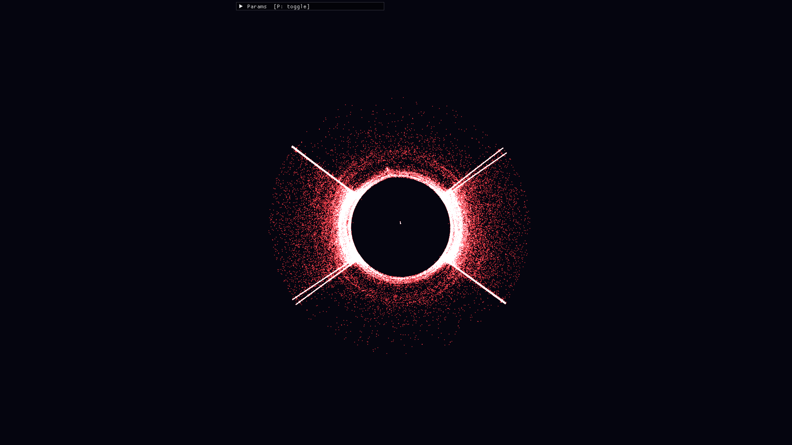

# Particle Flow



## 概要 / Overview

**Particle Flow** は、最大 300,000 個の粒子をリアルタイムに描画・物理演算し、マウスとキーボードで流れや模様を操作できるインタラクティブビジュアル作品です。

**Particle Flow** is an interactive visual piece that renders and simulates up to 300,000 particles in real time. Users can shape the movement with mouse and keyboard interactions such as attraction, vortex, ripple, convergence, and time stop.

操作動画と詳しい見どころは紹介サイトにまとめています。

View the demo page for interaction videos and a visual walkthrough.

### 紹介サイトを見る / View the Demo Site

[紹介サイト / Demo site](https://kobadaidesu.github.io/ryuusi/)

`docs/index.html` is deployed as GitHub Pages by `.github/workflows/pages.yml`.
GitHub上で `docs/index.html` をクリックするとHTMLソースが表示されるため、Webページとして見る場合は上の公開URLを使ってください。

On GitHub, opening `docs/index.html` shows the HTML source. Use the published URL above to view the rendered website.

Source files:

- [紹介サイトHTML / Demo HTML source](docs/index.html)
- [パラメーター詳細HTML / Parameter details source](docs/details/index.html)

## 主な機能 / Features

- 最大 300,000 個の粒子をリアルタイムに更新
- 引力、斥力、渦、爆発、波紋、収束、タイムストップによる操作
- Dear ImGui によるパラメーター調整 UI
- 色、粒子数、速度、重力、風、反発係数などのリアルタイム変更
- OpenGL 3.3 Core Profile による軽量な点描画

- Real-time updates for up to 300,000 particles
- Interaction modes: attract, repel, vortex, explode, ripple, converge, and time stop
- Parameter controls built with Dear ImGui
- Live tuning for color, particle count, speed, gravity, wind, bounce, and more
- Lightweight point rendering with OpenGL 3.3 Core Profile

## 操作方法 / Controls

| Input | Action |
| --- | --- |
| Left mouse | Attract particles |
| Right mouse | Repel particles |
| Middle mouse / S | Spawn particles |
| E | Explode around the cursor |
| V | Create a vortex |
| G | Converge particles |
| T | Toggle time stop |
| B | Create a ripple wave |
| R | Reset particles |
| F | Toggle fullscreen |
| P | Toggle HUD |
| Tab | Toggle parameter window |
| Esc / Q | Quit |

## 技術スタック / Tech Stack

- C99 / C++17
- SDL2
- OpenGL 3.3
- GLEW
- Dear ImGui
- Make / CMake

## ビルド方法 / Build

### Dependencies

Linux:

```bash
sudo apt install build-essential libsdl2-dev libglew-dev
```

macOS:

```bash
brew install sdl2 glew
```

### Make

```bash
make
./bin/particle_flow
```

Debug build:

```bash
make DEBUG=1
```

### CMake

```bash
cmake -S . -B build -DCMAKE_BUILD_TYPE=Release
cmake --build build
./build/particle_flow
```

## ディレクトリ構成 / Project Structure

```text
.
├── src/                 # Application, input, renderer, particle simulation
├── third_party/imgui/   # Dear ImGui source and SDL/OpenGL backends
├── docs/                # Demo site and interaction videos
│   ├── assets/images/
│   └── assets/videos/
├── Makefile
├── CMakeLists.txt
└── README.md
```

## 補足 / Notes

- `preset_*.bin` はアプリ内のプリセット保存機能で生成されるローカルファイルのため、Git 管理から除外しています。
- 操作動画は README に直接埋め込まず、`docs/index.html` に集約しています。
